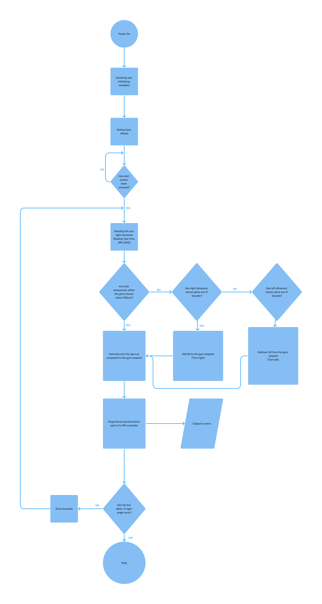

# Introduction to the team
We are Team 404, a group of three tenth graders from Dhirubhai Ambani International School who are interested in robotics and innovation. We have different roles and skills in our team:

**Arjun**: He is one of our programmers, who works mainly with PID and control algorithms when it comes to the bot. He designed most of the algorithms that go into integrating the sensor feedback and making our bot work precisely as it should.

**Atishaya**: He is another programmer, who works with Arjun to develop and test the robot’s software. He however, focusses mainly on aspects like low-level communication. He worked very hard on the initial code for the open and obstacle categories.

**Meher**: She is our constructor, who designed the mechanical systems of the bot. She specialises in Computer Aided Drawing but managed quite well with the practical construction aspects as well.

# Engineering process

### Programming and electricals
Initially, we were hoping to design our bot, completely devoid of any form of computer vision, relying on a network of colour and proximity sensors for both the open and obstacle categories. However, we very quickly realised that this was if not impossible then at least extremely impractical and switched to a raspberry pi based computer vision system. We looked into various systems and combinations of systems, including ROS to simplify the developmoent process and OpenCV or YOLO or even training our own model for the detection of the traffic signs. Eventually we settled on a combination of ROS to handle hardware coordination and OpenCV to handle object detection. Our openCV program involved masking the image to only read red and green and then running Canny edge detection followed by contour detection to find the traffic signs. Once the traffic signs were found, we would once again run a colour mask to find out whether they were red or green.

We quickly discovered that this process was not only quite difficult to program but it also caused the raspberry pi to become a massive computational bottleneck, slowing down our bot and making it extremely unreliable at high speeds. Looking into alternatives, we discovered HuskyLens, a device designed by DFRobot, that was built to solve exactly the problem we are facing. Switching to the HuskyLens, we added an arduino for low-level hardware communication and for controlling the motors. To this we added an l298N to control our DC motor alongside a DS 35kgcm servo. We also added an MPU6050 and ultrasonics which alongside a PID algorithm helped keep the bot centred on the track and prevent accidents.

After our nationals, we chose to further redesign our bot, we replaced the Arduino Uno with an Arduino Nano Esp32, a smaller and faster board. We also replaced the unreliable HC-SR04s with far more reliable analog ultrasonics from DFRobot, the URM-09s. We also added an ultrasonic in the front of the bot for the obstacle challenge round, where exiting each turn near the centre of the track was of the utmost importance. Our open code was very similar to before, utilizing nearly the same PID algorithm. We were however, forced to completely redesign our obstacle algorithm as it had proven to be unreliable and faulty during the nationals. 

## Construction
Our first chassis consisted of a mobile front axle connected to two links which were further attached to extrusions that formed the main frame of the robot. They were connected at a single pivot point, allowing the links to move back and forth, pulling the axle with it. The servo motor was initially attached to just one of these links. The overall transmission of power began with the servo moving one of the links left or right, which in turn pulled the shaft and other links left or right. Our rear axle remained the driving axle and was not connected to the servo in this design. While we wished to connect the second, non-powered link to the rear axle, we realized that would pull both axles in the same direction, which opposed the desired result. Further, this iteration was bulky and had a huge Instantaneous Center of Rotation (ICR), as a result, we first sought to make it more sophisticated in version 2. 

In our second version of the chassis, we decided to replace the 4-bar linkage system with a single, 3-D printed Servo-controlled link, which would in turn, transmit power to two 3-D Printed pivoting parts on the extrusion frame of the chassis to which the wheels were attached using bearings. This version was much smaller and more reliable than the last, however, it did consume valuable space that could have been used for housing electronic components. Further, this setup, much like the last, was a front-wheel steering and rear-wheel powered setup. Since a sharper turn than 40 degrees practically is unfeasible without major slipping, this setup still produced an ICR far too large to fit within the 1m box and made turning a challenge. 

# Programming

## Open category

Our code for the open category runs entirely on an Arduino ESP32 Nano. It receives inputs from various sensors which are combined in a simple PID controller program. For example, we use the yaw value from an MPU6050 to ensure that our bot maintains its heading parallel to the walls. We also take advantage of proximity values from our ultrasonic sensors to detect when the bot has to turn by checking if either of the proximity sensors read a value over 1 meter, which wouldn't be possible in the straight sections of the track. The sensor that has read this high value could only read it if the bot has passed the inner wall and is in a turning section. In this case, we will turn by 90 degrees towards the sensor that has read this high value.

Our bot’s steering is controlled exclusively by our PID controller, even during turns. It takes the yaw value from the Inertial Measurement Unit (MPU6050 in this case) and calculates the error from what the bot's heading should be. This is then run through a standard PID controller, using only the proportional and derivative aspects to calculate the correction the bot will have to make to return to the correct heading. When taking the turns in the corner section of the track, we simply add or subtract 90 degrees from the gyro setpoint, which is the value the PID controller uses to check the bots current heading against.

An issue we faced with turning was that the proximity sensors would read out of bounds multiple times during a single turn, leading to the bot's setpoint being increased by more than the 90 degrees that it should have. We overcame this issue quite simply by ensuring that the bot cannot make two turns within a set period of time, allowing us to create an extremely simple and reliable open code.

## Obstacle Category
After spending some time working with the Raspberry Pi, we decided our obstacle category program would be a lot simpler using an Arduino and some form of Artificially Intelligent Camera like the HuskyLens. Our program at a conceptual level is quite simple. The HuskyLens identifies objects on screen and recognises and categorises them as Red or Green traffic signs. This information is then transmitted to the Arduino, which checks if the sign is on the correct side of the screen. For example, if the traffic sign was red, the bot would make sure it was on the left side of its screen so that the bot passes it on the sign's right. The only real issue we faced with this program was that occasionally the bot would miss traffic signs at turns, if they were outside its Field Of View during the turn. To counteract this, we wrote a script that brings the bot out of the turn, and reverses it, allowing it to read the entire straight section, ensuring we do not miss any traffic signs. The steering and control mechanisms are otherwise almost exactly identical to the Open Category, with a slight distinction being the turning, and the alterations to the PID code to allow the bot to avoid the obstacles.

The way the bot actually avoids the obstacles is by forming a large arc around the obstacles, based on two factors. The distance travelled in the arc, given by the encoder count, and the magnitude of the arc, which is given by the turning angle. The turning angle is calculated as a function of the XCenter (which is the coordinates of the centre of the obstacle on a Cartesian plane, taking the centre of the camera Field of View as 0,0) and then recalculated at every iteration of the main loop as a function of the inverse of the encoder count, i.e., if the encoder count is 0, the turning angle will be maximum. The encoder count is also calculated as a function of the XCenter of the object. Making both the encoder count and the turning angle a function the XCenter of the object allows the bot to make smaller compensations for objects that are already close to where they should be, for example, if there is a red object to the left side of the screen (XCenter is negative), both the encoder count and turning angle will be a lot less, allowing the bot to make a smaller compensation, the reverse of course applies if a red traffic sign is on the right side of the screen. 

## Compiling the code
**Open**
The code for the open category can be used very simply by downloading the relevant .ino files and uploading them to an Arduino Nano ESP32 via the Arduino IDE. This will however also require the installation of the [MPU6050 Light library by rfetick](https://github.com/rfetick/MPU6050_light) alongside the [ESP32 Servo Library by JKB](https://github.com/jkb-git/ESP32Servo) from the arduino IDE library manager, the Wire library being included by default. You will also have to install the package for the Arduino Nano ESP32 as this is not included in the IDE by default. This is of course provided that the you have already constructed a similar bot and done the electricals for the same.

**Obstacle**
The code for the open category can be used very simply by downloading the relevant .ino files and uploading them to an Arduino Nano ESP32 via the Arduino IDE. This will however also require the installation of the [MPU6050 Light library by rfetick](https://github.com/rfetick/MPU6050_light), the [HuskyLens library](https://github.com/HuskyLens/HUSKYLENSArduino) from the given link alongside the [ESP32 Servo Library by JKB](https://github.com/jkb-git/ESP32Servo) from the arduino IDE library manager, the Wire library being included by default. You will also have to install the package for the Arduino Nano ESP32 as this is not included in the IDE by default. One would also have to train the HuskyLens by following the instructions [here](https://wiki.dfrobot.com/HUSKYLENS_V1.0_SKU_SEN0305_SEN0336) and training the HuskyLens to detect multiple colours, tagging Red as 1 and Green as 2. This is of course provided that the you have already constructed a similar bot and done the electricals for the same.

# Electricals
Our bot is based around the following components:
- Arduino Nano ESP32
- HuskyLens
- DS Servo (35kgcm)
- L298N motor driver
- DC-to-DC buck converter
- MPU 6050
- Ultrasonic sensor (URM-09)
- Orange Johnson 600 RPM DC motor
- Orange 11.1V 3 cell Lithium-Ion
- Jumper cables

### Arduino Nano ESP32
The Arduino Nano ESP32 is the brains of our bot, despite being a microcontroller rather than a single board computer like the Raspberry Pi, it is extremely powerful and versatile, able to reliably control our bot even at very high speeds. It takes inputs from the ultrasonic sensors and controls the servo and L298N with its digital pins while communicating over I2C with the MPU6050 and the HuskyLens. The Arduino is powered by a 3.3V line for one of our DC-to-DC buck converters.

### HuskyLens
The HuskyLens is an easy-to-use Artificially Intelligent camera. It has various built in features like facial recognition and object tracking. We however chose it for the incredible ease with which it could be programmed to detect and track a traffic light along with outputting its colour. It then communicates, the coordinates along with the width and height of this traffic light to our arduino via I2C. It is powered by a 3.3V line from the Arduino Nano ESP32.

### DS Servo
This servo is controlled by the arduino via a PWM signal on one of its digital pins. The servo rotates to the angle given to it by the arduino and thus steers the bot. It is powered by a DC-to-DC Buck converter that steps the 12V current from the battery down the the 9V more suitable to the servo.

### DC-to-DC buck converter
We are using 2 DC-to-DC buck converters to convert the 12V from the battery into both a 9V connection for the servo, and a 3.3V connection for the sensors and Arduino Nano ESP32.

### L298N motor driver and Orange 600 RPM DC motor
We chose the orange dc motor as it had a high enough torque to move our bot while not being too slow to make a good time as well. Given that we were using a motor of this size, the L298N was the only logical choice.  We control the L298N from three digital pins on the arduino. Two of those pins use high and low signals to determine the direction of the spinning of the motor while the third relies on a PWM pin to set the speed. These get their power directly from the battery as the motor requires 12V. THe L298N also outputs 5V power that we use to power our arduino and various sensors.

### Ultrasonic Sensor (URM-09)
The ultrasonic sensors are placed on either side of the bot, reading the distances from the walls the bot is travelling alongside. This allows us to detect when the bot has to turn, by reading for values over 1 meter. Each ultrasonic sensor shares its readings with the arduino using analog signals to analog in pins on the arduino. These sensors are powered from the 3.3V buck.

### Inertial Measurement Unit (MPU6050)
The MPU6050 is controlled by the Arduino via an I2C connection. The MPU is used to get a yaw value helping us find the current heading of the bot and keep the bot angled correctly. It is powered from the 3.3V buck.

## General Purpose Board
We also chose to solder the electronics for the bot onto a General Purpose Board as this would help to eliminate chaotic jumpers and make all the connections more reliable, cleaner and overall just easier to keep track of. This also allowed us to have a common ground for the entire bot. 

 
 
 

# Construction
As mentioned previously, our chassis designs had begun with inspiration from Ackermann Steering, which unfortunately failed for us in the CAD stage. However, during our research period, we found another mechanism that implemented all-wheel steering using a scissor mechanism. While that design was difficult to implement as it would require splitting or chassis in half, we drew inspiration from the same and decided to implement a similar steering to fix our problem of having a too-large ICR. Placing our servo motor beneath our chassis, we connected it to the independent front and back axles initially with links. However, this too, failed in the design phase as the bot would drift large distances. 

Thus, we attached on top of our servo, a gear. The gear was then connected with a pair of links each to the front and back axle, which are both independent of the main chassis frame. Thus, both front and back axles turned at the same time, in opposite directions, giving the desired narrow ICR. Unfortunately, after extensive testing, we concluded that the two axles were not turning at the same angles, making the turning unreliable. To combat the issue, we removed a gear and set of links from the front axle, making it a rear-steering bot.

We concluded in testing that there was lesser slippage and drift with the front wheels being powered. Thus, overall, the front and back axles are independent of the main chassis body, with the front axle powered, and the back axle steering.

The power transmission mechanism on the front wheels is simple, two gears, one on the wheel axis and the other on the motor were coupled, hence generating motion. 

All links, gears and other specialized components are 3D-printed in PLA. The belly pan of the chassis and other supporting components were made using a CNC machine out of polycarbonate.
